# Punk Building Block Series Vol. 1/i - Hair  (Incl. Beards & Eyebrows)

##  Hair (24×24)

 
  Blonde Bob (m/f)
   ,
  Blonde Short (m/f)
     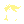,
  Clown Hair Green (m/f)
    ,
  Crazy Hair (m/f)
   ,
  Dark Hair (m/f)
    ,
  Frumpy Hair (m/f)
   ,
  Half Shaved (m/f)
     ,
  Messy Hair (m/f)
   ,
  Mohawk (m/f)
   ,
  Mohawk Dark (m/f)
   ,
  Mohawk Thin (m/f)
   ,
  Orange Side (m/f)
     ,
  Peak Spike (m/f)
    ,
  Pigtails (m/f)
   ,
  Purple Hair (m/f)
    ,
  Red Mohawk (m/f)
   ,
  Shaved Head (m/f)
   ,
  Straight Hair (m/f)
   ,
  Straight Hair Blonde (m/f)
    ,
  Straight Hair Dark (m/f)
   ,
  Stringy Hair (m/f)
   ,
  Vampire Hair (m/f)
    ,
  Wild Blonde (m/f)
     ,
  Wild Hair (m/f)
   ,
  Wild White Hair (m/f)
     

### More Hair Style & Color Series (24×24)

_Is orange the new black? Is white the new blonde?_

Afro (m/f)   

  
  
  
  
  
  
  
  
  
  
  
  
  
  
  
   
  
  
  
  
  
  
  
  
  
  
  
  
  
  
  

Big (m/f)   

  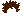
  
  
  
  
  
  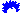
  
  
  
  
  
  
  
  
   
  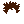
  
  
  
  
  
  
  
  
  
  
  
  
  
  

Bob (f)  

  
  
  
  
  
  
  
  
  
  
  
  
  
  
  

Buzz Cut (m/f)   

  
  
  
  
  
  
  
  
  
  
  
  
  
  
  
   
  
  
  
  
  
  
  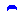
  
  
  
  
  
  
  
  

Clown (m/f)   

  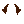
  
  
  
  
  
  
  
  
  
  
  
  
  
  
   
  
  
  
  
  
  
  
  
  
  
  
  
  
  
  

Crazy (m/f)   

  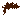
  
  
  
  
  
  
  
  
  
  
  
  
  
  
   
  
  
  
  
  
  
  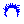
  
  
  
  
  
  
  
  

Faux Hawk (m)  

  
  
  
  
  
  
  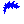
  
  
  
  
  
  
  
  

Frumpy (m/f)   

  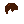
  
  
  
  
  
  
  
  
  
  
  
  
  
  
   
  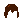
  
  
  
  
  
  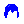
  
  
  
  
  
  
  
  

Half Shaved (f)  

  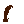
  
  
  
  
  
  
  
  
  
  
  
  
  
  

Heart (f)  

  
  
  
  
  
  
  
  
  
  
  
  
  
  
  

Long (m)  

  
  
  
  
  
  
  
  
  
  
  
  
  
  
  

Long Curly (f)  

  
  
  
  
  
  
  
  
  
  
  
  
  
  
  

Messy (m/f)   

  
  
  
  
  
  
  
  
  
  
  
  
  
  
  
   
  
  
  
  
  
  
  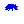
  
  
  
  
  
  
  
  

Mohawk (m/f)   

  
  
  
  
  
  
  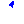
  
  
  
  
  
  
  
  
   
  
  
  
  
  
  
  
  
  
  
  
  
  
  
  

Peak Spike (m)  

  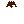
  
  
  
  
  
  
  
  
  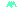
  
  
  
  
  

Pigtails (f)  

  
  
  
  
  
  
  
  
  
  
  
  
  
  
  

Pixie (f)  

  
  
  
  
  
  
  
  
  
  
  
  
  
  
  

Short (m/f)   

  
  
  
  
  
  
  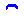
  
  
  
  
  
  
  
  
   
  
  
  
  
  
  
  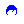
  
  
  
  
  
  
  
  

Side (f)  

  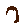
  
  
  
  
  
  
  
  
  
  
  
  
  
  

Straight 1 (f)  

  
  
  
  
  
  
  
  
  
  
  
  
  
  
  

Straight 2 (f)  

  
  
  
  
  
  
  
  
  
  
  
  
  
  
  

Stringy (m/f)   

  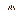
  
  
  
  
  
  
  
  
  
  
  
  
  
  
   
  
  
  
  
  
  
  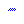
  
  
  
  
  
  
  
  

Widow's Peak (m)  

  
  
  
  
  
  
  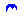
  
  
  
  
  
  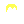
  
  

Wild 1 (m/f)   

  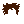
  
  
  
  
  
  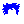
  
  
  
  
  
  
  
  
   
  
  
  
  
  
  
  
  
  
  
  
  
  
  
  

Wild 2 (f)  

  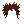
  
  
  
  
  
  
  
  
  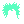
  
  
  
  
  

Wild 3 (f)  

  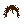
  
  
  
  
  
  
  
  
  
  
  
  
  
  

More

Style 1 (m/f)   

  
  
  
  
  
  
  
  
  
  
  
  
  
  
  
   
  
  
  
  
  
  
  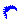
  
  
  
  
  
  
  
  

Style 2 (f)  

  
  
  
  
  
  
  
  
  
  
  
  
  
  
  

Style 3 (f)  

  
  
  
  
  
  
  
  
  
  
  
  
  
  
  

### Rainbow Series (24×24)

_Red, orange, yellow, green, blue, indigo and violet_

Rainbow Hair (m/f)

### Wall Street Bets Series (24×24)

_Power to the punks_

Hair  
  
  
  
  
  

## Beards (24×24)

  Big Beard (m)
   ,
  Chinstrap (m)
   ,
  Front Beard (m)
   
   ,
  Goat (m)
   ,
  Handlebars (m)
   ,
  Luxurious Beard (m)
   
   ,
  Messy Beard (m)
   ,
  Mustache (m)
   ,
  Muttonchops (m)
   ,
  Normal Beard (m)
   
   
   ,
  Shadow Beard (m)
   ,
  Short Beard (m)
   

## Eyebrows (24×24)

## Questions? Comments?

Join us in the [Punk Art discord (chat server)](https://discord.gg/FE3HeXNKRa). Yes you can.
Your questions and commentary welcome.

Or post them over at the [Help & Support](https://github.com/geraldb/help) page. Thanks.

